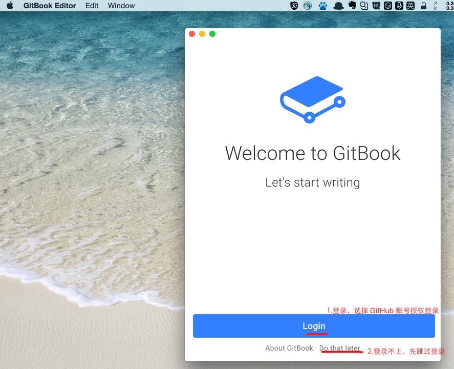
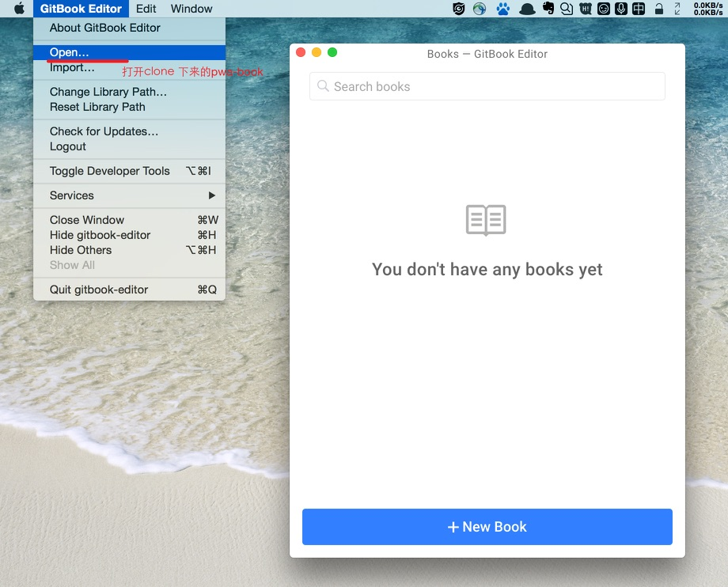
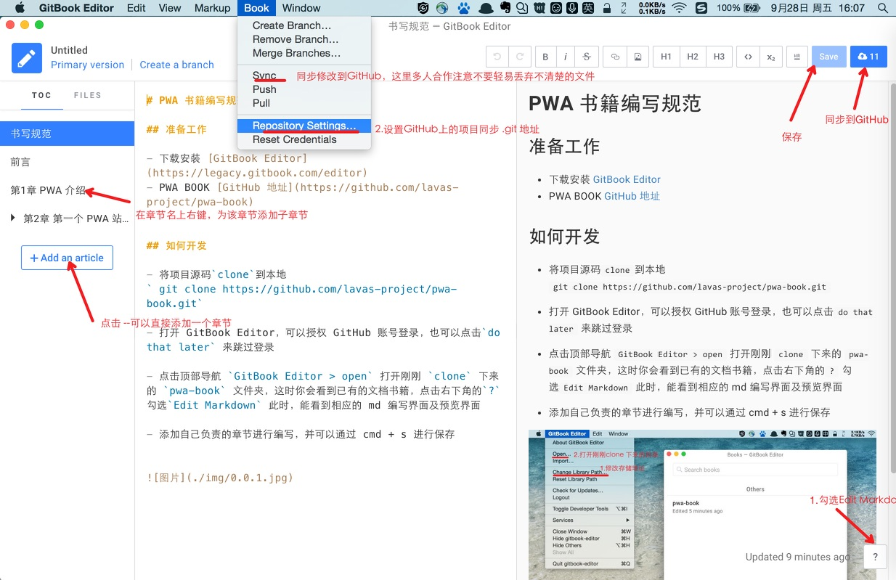
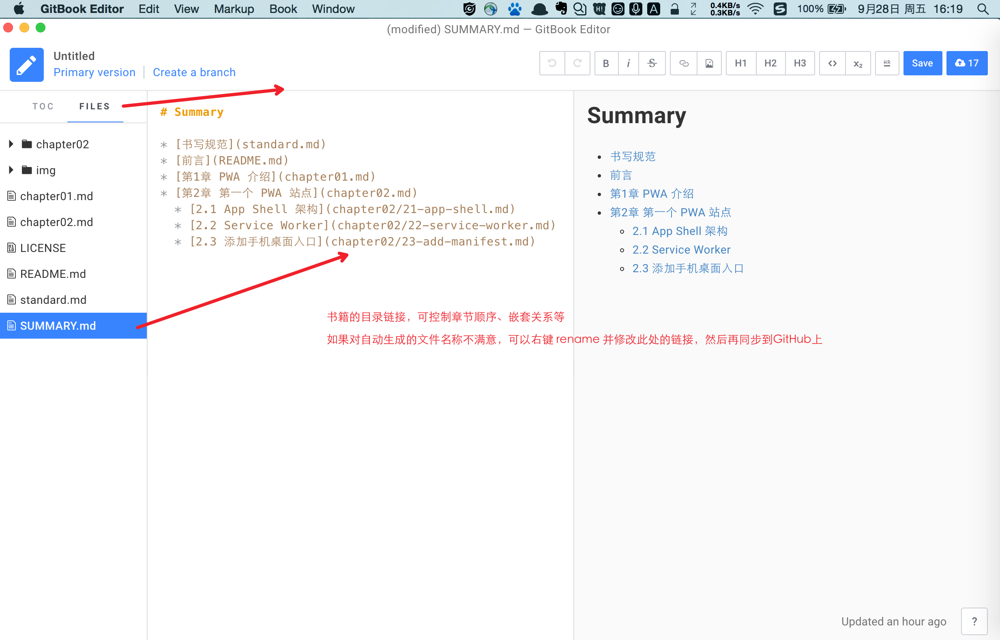

# PWA 书籍编写规范

## 准备工作

- 下载安装 [GitBook Editor](https://legacy.gitbook.com/editor)

- GitHub 项目代码`clone`到本地

`git clone https://github.com/lavas-project/pwa-book.git`

----

## 如何开发 & 注意事项

- 打开 GitBook Editor 会提示登录，可以选择 GitHub 账号授权登录，或是`do that later`跳过登录

- 点击顶部导航栏的`GitBook Editor > open`打开刚刚`clone`下来的`pwa-book`文件夹，这时你会看到已有的文档书籍

- 开始编写前还需要几个必要的配置：
   - 点击右下角`？`勾选`Edit Markdown`，此时，你能看到 md 的编写界面及预览界面；
   - 顶部导航选择`Book > Repository Settings` 看看是否是对应的书籍 GitHub 地址，便于后面两边文件的同步
   - 点击侧边栏的添加章节，在章节名右键新建章节子目录

- **书写注意**：
   - 最多保留一级子目录，如 1.1.X 均合并在 1.1 章节写完
   - 章节层级标题从`# 第一章 xxxx`开始，章节内子目录层级标题从`## 1.1 xxxx` 开始，尽量文章中子标题都带上层级号，如 `1.1.1 xxxx`、`1.1.2 xxxx`
   - 图片/代码块/表格均以章节来区分，标注格式为“章节号-编号 说明”，如“图1-1 生命周期图”、“表1-2 属性列表”、“代码1-2 Service Worker 注册”，内容较多且不确定的章节，可后期再进行标注
   - 文章中出现的路径名、文件名、命令、代码等都用进项包裹

- 侧边栏的`FILES`选项是对应生成的源码文件，会同步到 GitHub 上，如果对自动生成的文件名称不满意需要修改，可以在相应的文件右键`rename`(**注意：需要同步修改 SUMMARY.md 中的目录路径，书籍的目录顺序、嵌套等也可以在此调整**)

- 代码同步，点击屏幕右上角的`sync` ，也可以点击顶部导航`BOOK > Sync/pull/push`等做相应的操作，由于多人合作，切记代码要认真核对是否覆盖删除等，同步完成后可以查看 GitHub 验证自己的修改

----

## 目录及分工

> 编写完毕后，在此处和[Github issue](https://github.com/lavas-project/pwa-book/issues/1)上同步进度。

- [ ] PWA 介绍 **(陈永乐)**
- [ ] 第一个 PWA 站点 **(刘若然)**
- [ ] 设计与体验（重理念轻实战）**(王轶盛)**
  - [ ] App Shell
  - [ ] Skeleton
  - [ ] 动画
- [ ] 离线与缓存**(黄辉泉、淼江)**
	- [ ] Service Worker 简介 
	  - [ ] 简介
	  - [ ] 发展史
	  - [ ] 基本特性
	  - [ ] https 与 service worker
	  - [ ] service worker 在浏览器缓存中发生作用的时机（可与其他缓存对比）
	- [ ] Service Worker 初探
	  - [ ] 生命周期
	  - [ ] 注册过程
	  - [ ] scope
	  - [ ] 编写一个基本的 service worker
	  - [ ] 常用调试方式
	  - [ ] 离线注意事项
	  - [ ] 后台同步
	  - [ ] 消息推送
	- [ ] Cache API
	- [ ] IndexDB
	- [ ] Service worker 缓存管理
	  - [ ] 常用缓存策略
	  - [ ] fetch API
	  - [ ] Service Worker 更新
	- [ ] 如何在 SPA/MPA/SSR 中使用 Service Worker
		- [ ] SPA/MPA
		- [ ] SSR
	- [ ] 使用 Workbox 快速编写 Service Worker
- [ ] 用户留存**（唐雷）**
	- [ ] Web App Manifest 
    - [ ] credentials API
    - [ ] Notification API
- [ ] 安全**（ck & 陈秋实）**
- [ ] 性能**（颜适）**
- [ ] 使用 LAVAS 快速搭建 PWA 站点**(李文倩，若然）**
	- [ ] cli，安装，基本要求和构成
	- [ ] 配置式构建
    - [ ] 路由（自动生成+配置式）
    - [ ] 中间件 **(若然)**
    - [ ] 状态管理 **(若然)**
	- [ ] PWA
- [ ] 使用 lighthouse 检验站点 **(陈秋实)**
- [ ] PWA 搜索生效 **(彭星)**
	- [ ] PWA 与 SEO
	- [ ] PWA 与 MIP 和 AMP
- [ ] PWA 的未来 **(彭星)**
	- [ ] 标准化的历程

